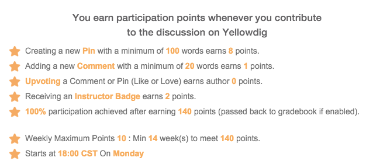

Class 2: Ethical Implications of Technology
========================================================
font-import: http://fonts.googleapis.com/css?family=Lato
font-family: 'Lato'
css: custom.css
author: Bodong Chen, Assistant Professor
date: CI 4311W, University of Minnesota

Housekeeping
========================================================

- FlipGrid
- Yellowdig
  - Expectations
  - Grades/points
- Learn as a "community" -- responsible to each other

Class 1 Recap - What is ethics?
========================================================

- Right vs. wrong
- Social norms/standards
- Obligations
- Betterment of society
- Morality / moral codes
- Fairness
- Religion / religious beliefs
- Law vs. ethics
- Varies across societies, cultures or individuals, or even time
- Should a society hold a set of "undisputable" ethical principles?

Class 2 - Ethical Implications of Technology
========================================================

- Reading: _Kaplan (2004)_
- Discuss on Yellowdig
  - _Drawing from the reading and your own thinking, create your definition of technology, and give us an example of something that both fits your definition and you find exciting._
  - minimally 1 original post + 2 comments
  - using external resources (links, videos, etc.) will be a plus
  - *Instructor Badges* -- e.g., deep engagement, critical contribution

